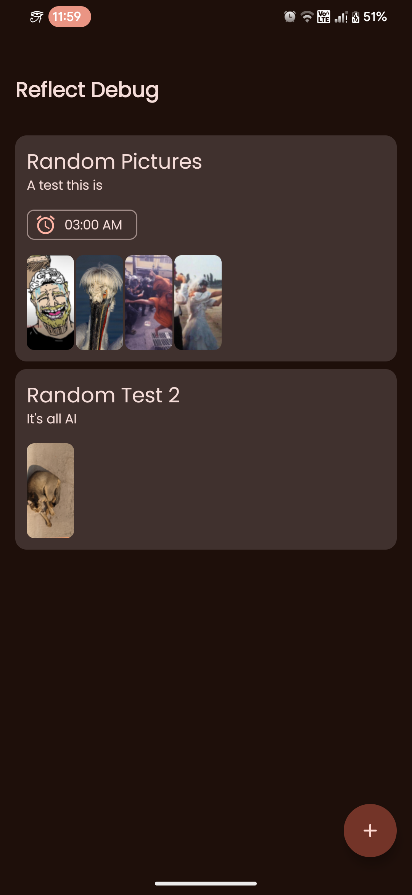
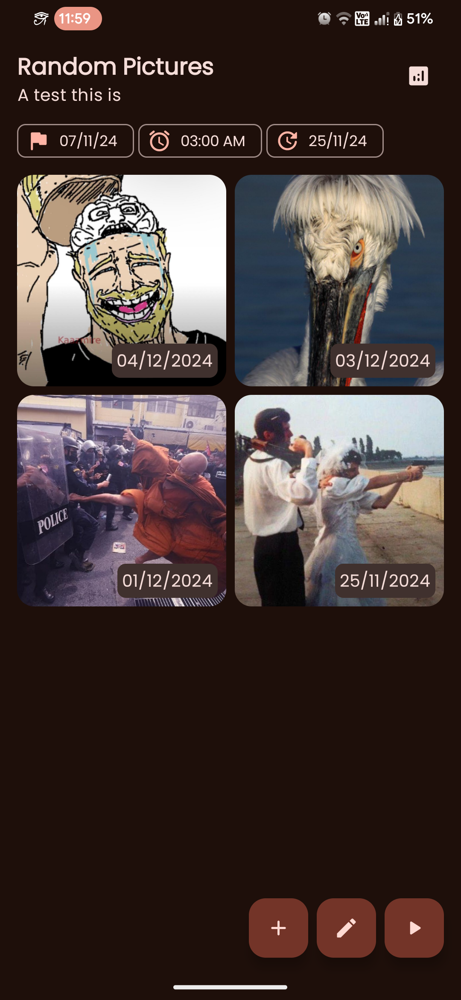

# ⚒️ Reflect ⚒️

### An android app to track your progress on anything using montages.

Remember this [meme?](https://www.youtube.com/watch?v=65nfbW-27ps&pp=ygURYWdlIDEyIHRvIG1hcnJpZWQ%3D), Yeah the goal of this app is to allow users to make montages like these without thinking about storage and editing.
Currently the following features are planned: 

- [x] Database and libraries setup
- [ ] Detecting, labelling and storing pictures
- [ ] Making and sharing Montages
- [ ] Notification reminders
- [ ] Customisations

If you are interested in collaborating, discussing or becoming a beta tester, ping me at telegram or discord `@shub39`

## ✨ Screenshots ✨

|  |  |
|:-------------------------------------------------------------------:|:-------------------------------------------------------------------:|